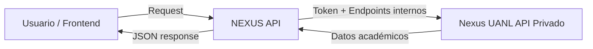

# NEXUS API UANL

  

**NEXUS API** es un API REST de código abierto que permite acceder a la información académica de NEXUS UANL de forma clara y documentada. Ideal para estudiantes, desarrolladores o cualquier persona interesada en construir aplicaciones web, dashboards o integraciones personalizadas con datos de la universidad.

Esta idea nació cuando se me vencieron algunas tareas y, inspirado por un proyecto de API de SIASE en GitHub, pensé: _"¿Por qué no crear un API que me permita recibir recordatorios automáticos de mis tareas?"_. Así nació NEXUS API, que sirve información real del sistema de manera accesible y estandarizada.

---

## 🚀 Cómo funciona



NEXUS API se comunica con los endpoints internos de Nexus para obtener información de cursos, profesores, tareas y alumnos.

La autorización se realiza mediante un token de acceso generado al iniciar sesión en los servicios digitales de la UANL.

- Inicialmente se utilizaba Selenium para obtener el token desde la interacción con el DOM, luego migré a Playwright, más simple y ligero.
- Luego se replico completamente el ciclo de generación de sesión/token desde el login en SIASE, eliminando la simulación de entrada de usuario.
- NEXUS API actúa como intermediario entre programadores y la API privada, sirviendo la información de forma segura y documentada.
- Actualmente NEXUS API no cuenta con un front-end organizado, planeo desarrollar uno que exponga la documentacion de manera clara y concisa al usarse, actualmente se puede probar la API desde el servidor con el generador automatico de doc. de FASTAPI

## 📦 Stack tecnológico

- **Backend**: Python + FastAPI
- **Automatización**: Ya no utilizado pero disponible si se desea usar (codigo comentado) Playwright (anteriormente Selenium)
- **Bases de datos/cache**: Cache "HardCoded" Redis AUN NO IMPLEMENTADO

## 🔧 Instalación / Uso básico

### Clonar repositorio:

```bash
git clone https://github.com/tu-usuario/nexus-api.git
cd nexus-api
```

### Instalar dependencias:

```bash
pip install -r requirements.txt
```


### Correr API localmente:

```bash
uvicorn app.main:app --reload
```

### Ejemplos de requests:

#### Login (obtener token):

bash

```bash
curl -X POST "http://127.0.0.1:8000/login" \
  -H "Content-Type: application/json" \
  -d '{
    "user": "xxxxxxx",
    "password": "xxxxxxx"
  }'
```

#### Obtener cursos (cURL):

bash

```bash
curl --location 'http://127.0.0.1:8000/cursos' \
--header 'Content-Type: application/json' \
--header 'accept: application/json' \
--data '{
  "user": "xxxxxxx"
}'
```

#### Obtener cursos (Python):

python

```python
import requests
import json

url = "http://127.0.0.1:8000/cursos"
payload = json.dumps({
  "user": "xxxxxxx"
})
headers = {
  'Content-Type': 'application/json',
  'accept': 'application/json'
}

response = requests.post(url, headers=headers, data=payload)
print(response.text)
```

## 📝 Endpoints principales

|Endpoint|Método|Descripción|Parámetros|Autenticación|
|---|---|---|---|---|
|`/`|GET|Redirige a la documentación automática|-|No|
|`/login`|POST|Autentica usuario y obtiene token|`user`, `password`|No|
|`/cursos`|POST|Lista todos los cursos del usuario|`user`|Sí|
|`/calendario`|POST|Obtiene tareas y eventos del calendario|`user`|Sí|
|`/user`|POST|Obtiene información del usuario autenticado|`user`|Sí|

**Modelos de datos:**

- **User**: `{"user": "string", "password": "string"}`
- **TokenRequest**: `{"user": "string"}`

**Notas importantes:**

- Todos los endpoints (excepto `/` y `/login`) requieren autenticación previa
- El token se almacena en caché interno usando el nombre de usuario como clave
- Los endpoints autenticados requieren enviar el `user` en el body para recuperar el token del caché
## ⚠️ Estado del proyecto

- Código abierto y funcional en local.
- Funcionalidad muy basica por el momento
- Planeo implementar autenticacion JWT/OAUTH para seguridad y persistencia de sesiones.
- Planeo hostearlo públicamente para acceso directo, pero aún no ha sido posible.

## 🔗 Próximos pasos / mejoras

- Hosting en la nube (AWS) para acceso público.
- Documentación avanzada de todos los endpoints con ejemplos en JSON.
- Nuevos endpoints basicos y  endpoints especificos según sugerencias de la comunidad.
- Añadir tests unitarios y CI/CD para despliegue automático.
- Gestor de alertas por Whatsapp/Correo, envio de tareas por WhatsApp. (NO BS. NEXUS)
- Arreglar Hardcoded endpoints.
- Modularizar y optimizar codigo.
- Implementar y documentar codigos de error especificos.

## 🤝 Contribuciones

1. Haz un fork del repositorio.
2. Crea una rama con tu feature: `git checkout -b feature/nueva-funcionalidad`.
3. Haz commit de tus cambios: `git commit -am 'Agrega nueva funcionalidad'`.
4. Push a la rama: `git push origin feature/nueva-funcionalidad`.
5. Abre un Pull Request.

Por favor, asegúrate de seguir el estilo de código y añadir tests si es necesario.

## 📝 Licencia

MIT License – puedes consultar el archivo LICENSE para más detalles.

---

NEXUS API facilita la creación de frontends personalizados o cualquier otra integración académica, haciendo que la información de Nexus UANL sea accesible, segura y profesional.